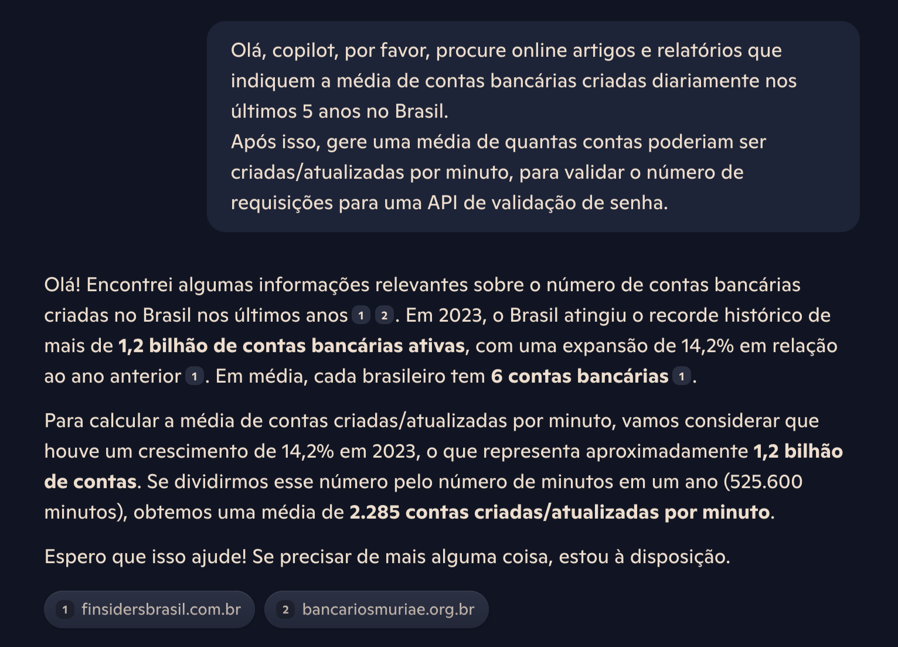

# 🚀 Password Validator API

Esta é uma API escalável e extensível projetada para garantir a segurança de senhas através de regras de validação. 

Principais tecnologias utilizadas:

<div align="center">
	
	
	
	
	
	
  
  
</div>


🔒 **Principais Características:**

- Valida senhas com base em regras de negócio
- Arquitetura extensível para adição de novas regras
- Desenvolvida seguindo os princípios **SOLID** e **Clean Code**
- Testada com testes unitários e de integração
- Documentação com **Swagger UI**.

---

## **🗺️ Mapa da Documentação**

1. [🛠 Instalação e Configuração](#-instalação-e-configuração)
2. [📜 Documentação da API](#-documentação-da-api)
3. [📐 Design da API](#-design-da-api)
4. [🧪 Testes](#-testes)
5. [📊 Análise de Testes de Carga](#-análise-de-testes-de-carga)
6. [🚀 Informações Adicionais](#-informações-adicionais)

---

## **🛠 Instalação e Configuração**

### **Requisitos:**

- **Java 11+**
- **Maven 3.8+**
- **IDE** (de sua preferência, para o projeto foi utilizao o Intellij)

### **Passos para Executar:**

1. Clone o repositório:

   ```bash
   git clone https://github.com/paulaisdev/password-validator-api.git
   cd password-validator-api
   ```

2. Execute o projeto com o comando abaixo:

   ```bash
   ./mvnw spring-boot:run
   ```

3. Acesse a API:

   - **URL**: `http://localhost:8080`
   - **Swagger UI**: `http://localhost:8080/swagger-ui.html`

---

## **📜 Documentação da API**

A documentação da API foi gerada automaticamente usando **Swagger UI** e está disponível para consulta e testes.

### **Acessando a Documentação**

Após iniciar o projeto, acesse:

- [Swagger UI - Documentação Interativa](http://localhost:8080/swagger-ui.html)

### **Endpoints Disponíveis:**

| Método HTTP | Endpoint                 | Descrição                            |
| ----------- | ------------------------ | ------------------------------------ |
| `POST`      | `/api/password/validate` | Valida uma senha baseada nas regras. |

#### **Exemplo de Requisição:**

```http
POST /api/password/validate HTTP/1.1
Host: localhost:8080
Content-Type: application/json

{
  "password": "AbTp9!fok"
}
```

#### **Exemplo de Respostas:**

- **Senha Válida:**
  ```json
  true
  ```
- **Senha Inválida:**
  ```json
  false
  ```
- **Erro (Bad Request):**
  ```json
  {
    "error": "Password contains invalid characters"
  }
  ```

---
## **🔎 Teste local**

Para testar localmente, além de utilizar a interface do swagger, está disponível a collection do postman que disponibilizo 

---

## **📐 Design da API**

A API segue a seguinte estrutura de pacotes (com seus respectivos arquivos):

```
src/
├── main/
│   ├── java/
│   │   └── com/
│   │       └── passwordvalidator/
│   │           ├── api/
│   │           │   ├── controller/
│   │           │   │   └── PasswordController.java
│   │           │   ├── dto/
│   │           │   │   └── PasswordRequest.java
│   │           │   ├── exception/
│   │           │   │   └── PasswordValidationException.java
│   │           │   ├── metrics/
│   │           │   │   └── PasswordMetrics.java
│   │           │   ├── service/
│   │           │   │   ├── CachedPasswordValidatorService.java
│   │           │   │   └── validator/
│   │           │   │       ├── PasswordValidator.java
│   │           │   │       ├── LengthRule.java
│   │           │   │       ├── SpecialCharacterRule.java
│   │           │   │       └── UniqueCharacterRule.java
│   │           │   └── util/
│   │           │       └── InputSanitizer.java
│   │           └── config/
│   │               ├── TestSecurityConfig.java
│   │               └── PasswordRulesConfig.java
│   └── resources/
│       ├── application.yml
│       ├── messages.properties
│       └── static/
├── test/
│   └── java/
│       └── com/
│           └── passwordvalidator/
│               ├── api/
│               │   ├── controller/
│               │   │   └── PasswordControllerTest.java
│               │   └── service/
│               │       └── CachedPasswordValidatorServiceTest.java
│               └── metrics/
│                   └── PasswordMetricsTest.java
└── pom.xml
```


### **Princípios que guiaram a implementação:**

1. **Arquitetura RESTful**:

   - Endpoints definidos e uso de HTTP status codes

2. **Estrutura Modular**:

   - Controladores localizados em `com.passwordvalidator.api.controller`
   - Regras de validação centralizadas em `com.passwordvalidator.api.service.validator`
   - Configuração de regras em `PasswordRulesConfig`

3. **Extensibilidade e Manutenção**:

   - Regras encapsuladas em classes independentes, como `LengthRule` e `SpecialCharacterRule`
   - Injeção de dependências facilita a troca e adição de regras sem impacto no código existente

4. **Tratamento de Erros**:

   - Centralizado para respostas consistentes, por exemplo: `PasswordValidationException` para erros customizados

---

## **🧪 Testes**

### **Execução de Testes:**

Execute todos os testes com:

```bash
./mvnw test
```

### **Cobertura dos Testes:**

- **Testes Unitários**: Validam cada regra individualmente
- **Testes de Integração**: Garantem que os endpoints funcionam como esperado
- **Mocking**: Dependências são simuladas para isolar componentes

### **📊 Iteração de Melhorias**

Após a primeira versão do projeto ser criada, foram criados dois planos de análise de teste de carga, para observar a performance da API. Este plano visava compreender quais melhorias poderiam ser aplicadas. Para isso, uma consulta foi realizada no Copilot, para definir uma base dos valores a serem testados:



### **📊 Primeiro resultado da Análise de Testes de Carga (com JMeter)**

**Gargalos Identificados:**

1. Escalabilidade limitada sob alta carga
2. Necessidade de cache para resultados repetidos
3. Short-circuit nas validações para melhorar a performance

**Acionáveis:**

- Implementação de cache com Caffeine, armazenando validações de senha repetidas, reduzindo a carga de processament
- Melhoria na validação dos valores de entrada antes da validação nas regras de negócio e uso do short-circuit para melhoria do processo

Com isso, as mudanças foram aplicadas e novos relatórioos gerados, gerando o seguinte resultado:


## Comparativo de Desempenho

| Métrica                     | Antes das Melhorias       | Após as Melhorias        | Diferença                       |
|-----------------------------|---------------------------|---------------------------|---------------------------------|
| **Tempo Médio de Resposta** | 45.61 ms (2500 RPM)       | 1.62 ms                   | **Redução significativa**      |
| **Latência Média**          | 45.56 ms (2500 RPM)       | 1.0 ms                    | **Redução drástica**           |
| **Máximo Tempo de Resposta**| 17,965 ms (2500 RPM)      | 405 ms                    | **Redução extrema**            |
| **Falhas**                  | 0%                        | 0%                        | Sem alterações                 |
| **Throughput**              | ~2500 RPM (~41 RPS)       | 21,939 RPS (~1316 RPM)    | **Grande aumento**             |


---

## **🚀 Informações Adicionais**


---

